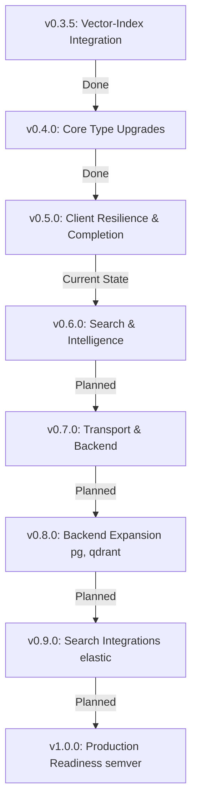

# llm-kernel Roadmap Evaluation Report

This report evaluates the `llm-kernel` library's development roadmap (from v0.3.2 to v1.0.0), compares it with the actual implementation status in the codebase, identifies discrepancies, and provides architectural recommendations.

---

## 1. Executive Summary

* **Actual Development Progress**: The codebase is currently at **v0.5.0 (Client Resilience & Completion)**. (Based on `Cargo.toml` and `CHANGELOG.md` data)
* **Key Discrepancies Identified (Out-of-sync Documentation)**:
  * [PROGRESS.md](file:///Users/hackme/projects/epiccounty/llm-kernel/PROGRESS.md) is outdated, stating that the current version is `v0.3.5` and categorizing the completed `v0.4.0` and `v0.5.0` features as "Next" / "Planned".
  * [README.md](file:///Users/hackme/projects/epiccounty/llm-kernel/README.md) and all translation versions under `docs/i18n/*/README.md` still hardcode dependency examples to `0.3.4`.
* **Next Milestone (v0.6.0)**: Search and Intelligence is the next target. Code verification shows that deliverables under this phase (e.g., `src/search/mod.rs` modifications) are currently unimplemented, marking it as a clean starting point.
* **Architecture Assessment**: The strategy of defining trait interfaces before database implementation (e.g., PostgreSQL, Qdrant) is excellent. However, potential technical risks exist regarding **FTS5 CJK tokenizer development** and **native C-compiler dependencies**.

---

## 2. Discrepancies Between Documentation and Codebase

The version statuses across files are currently out of sync:

| Document / File | Stated Version | Status & Context |
| :--- | :---: | :--- |
| **[Cargo.toml](file:///Users/hackme/projects/epiccounty/llm-kernel/Cargo.toml)** | `0.5.0` | Source of truth package version for the library |
| **[CHANGELOG.md](file:///Users/hackme/projects/epiccounty/llm-kernel/CHANGELOG.md)** | `0.5.0` | Fully populated with release logs up to `v0.5.0` (as of 2026-06-13) |
| **[ROADMAP.md](file:///Users/hackme/projects/epiccounty/llm-kernel/ROADMAP.md)** | `0.5.0` complete | Correctly marked as `v0.5.0 complete ✅` |
| **[PROGRESS.md](file:///Users/hackme/projects/epiccounty/llm-kernel/PROGRESS.md)** | `0.3.5` | **[Out of Sync]** Frozen on 2026-06-11; lists `v0.4.0` and `v0.5.0` as incomplete |
| **[README.md](file:///Users/hackme/projects/epiccounty/llm-kernel/README.md)** | `0.3.4` | **[Out of Sync]** Installation blocks still reference older version tags (affects all languages) |

> [!WARNING]
> **Action Required**: Update `PROGRESS.md` to reflect `v0.5.0` completion status, and update version variables in `README.md` and its translations to `0.5.0` to avoid confusing consumers.

---

## 3. Detailed Phase Evaluation

### ✅ Completed Milestones: v0.3.x ~ v0.5.0
* **Evaluation**: Essential client functionalities—including tool calling, multimodal representations, conversation history management, and exponential backoff retry mechanics—are fully implemented. The client is now production-ready.
* **Highlights**: Absorbing `llm-kernel-vector-index` into the main crate under the `vector-index` feature gate was a sound decision, reducing codebase fragmentation and easing distribution.

### 🔜 Next Milestone: v0.6.0 (Search & Intelligence)
This upcoming milestone focuses on abstracting search and structuring prompt interfaces.

1. **`SearchProvider` Trait (`src/search/mod.rs`)**:
   * *Evaluation*: Establishing a unified interface for BM25, vector, and web searches is logical and aligns well with the existing `rrf_fuse` utility.
2. **Score Normalization & Alternative Fusion (CombMNZ, etc.)**:
   * *Evaluation*: Normalizing scores across keyword (unbounded BM25) and semantic (0.0-1.0 cosine) bounds is crucial for producing high-quality hybrid ranking outputs.
3. **Prompt Injection Detection & Templates**:
   * *Evaluation*: Adding `src/safety/injection.rs` and `src/llm/template.rs`. Implementing CJK-aware token-budget chunking (`src/tokens/chunk.rs`) will optimize RAG pipelines.

### 📋 Long-term Design: v0.7.0 ~ v0.9.0 (Backend & Integrations)
* **Separation of Traits (v0.7.0)**:
  * Introducing `GraphBackend` and `KvStore` abstractions before developing PostgreSQL and Qdrant backends is highly consistent with clean coding and hexagonal architecture principles.
* **Backend Expansion (v0.8.0 ~ v0.9.0)**:
  * Considered splitting backend extensions into standalone workspace crates to keep the core `llm-kernel` crate lightweight — a sound dependency-management strategy.
  * **Update (v0.8.0):** the project instead shipped these as in-crate feature gates (`graph-pg`, `qdrant`) — same dependency-isolation benefit (drivers stay optional), with single-crate consistency matching `embedding-fastembed`/`mcp-http`. The SQLite↔PostgreSQL migration CLI lives at `src/bin/migrate.rs` behind `graph-pg`.

---

## 4. Risks & Recommendations

### ⚠️ Technical Risks
1. **FTS5 CJK Tokenizer Complexity (v0.7.0)**:
   * Writing or bundling custom CJK tokenizers for SQLite FTS5 requires binding with C-FFI callbacks, which introduces native compilation dependencies and memory management risks.
2. **C-Compiler (`cc`) Environment Dependencies**:
   * Compiling features like `rusqlite(bundled)` or `aws-lc-sys` depends on `cc` availability, which can cause builds to fail in headless or containerized environments. Using pure Rust crates (e.g., `rustls` configurations without native bindings) is recommended where possible.

### 💡 Strategic Recommendations
* **Automate Version Updates**: Establish a release workflow (pre-commit hook or GitHub Action) that automatically updates version tags in `README.md` and `PROGRESS.md` whenever the version is bumped in `Cargo.toml`.
* **Adopt Application-side CJK Indexing**: Instead of relying on SQLite's native FTS5 custom tokenizer (Option A), prioritize adopting a safe-Rust N-gram tokenizer mapped to a relational posting schema (Option B). This keeps compilation pure Rust and makes PostgreSQL porting in `v0.8.0` seamless.
